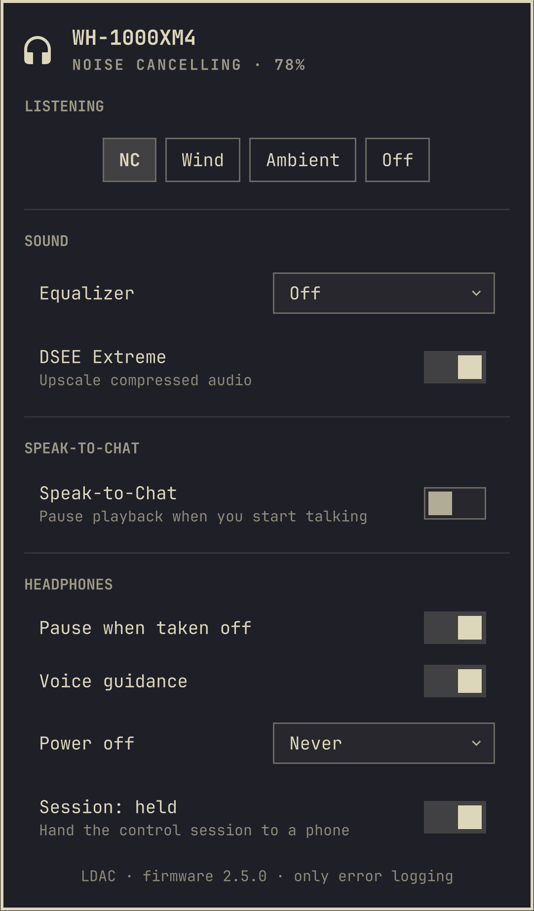

# Sony Headphones for Omarchy

[](https://github.com/gabamnml/omarchy-sony-headphones/actions/workflows/test.yml)
[](LICENSE)
[](https://omarchy.org)
[](#supported-models)

**Control Sony WH-1000X headphones from the Omarchy bar the way the phone app does — noise cancelling, ambient sound, the equalizer, DSEE Extreme, Speak-to-Chat and battery — without a phone, a vendor app, or a desktop GUI.**


*The panel on a WH-1000XM6: the widget sits in the bar with the battery reading beside it, and the icon follows the mode — headphones while noise cancelling, an ear in ambient sound, struck through when the headphones are off or away.*

It talks Sony's own Bluetooth protocol directly over RFCOMM, in one self-contained Python file of about 4,500 lines, depending on nothing but the standard library and `bluetoothctl`.


*The widget in the bar, on the same machine as the panel above.*

```
Left click    open the panel
Right click   cycle noise cancelling → ambient sound → off
Scroll        ambient sound level
Middle click  refresh
```

[Wiki index](docs/wiki/index.md) · [Usage](docs/wiki/usage.md) · [Architecture](docs/wiki/architecture.md) · [Agent docs](docs/agents.md)

## Feature showcase

- **No phone, no vendor app.** The helper speaks the headphones' own protocol, so the settings live in the Omarchy bar instead of Sound Connect.
- **Both command sets.** Protocol v1 (WH-1000XM2/XM3/XM4) and v2 (WH-1000XM5/XM6, WF-1000XM5, LinkBuds, CH720N) are handled by the same widget.
- **Only the rows that work.** The panel draws the controls the connected model actually honours, so a setting never silently does nothing.
- **The session is yours to share.** Hold the one control session for live settings, or release it so a phone paired over multipoint can take over.
- **Keyboard, keybindings and a CLI.** Drive the panel with the keyboard, bind a key to cycle noise cancelling, or use the helper on its own.
- **Local only.** It talks to the headphones and `bluetoothctl`, never the network, and treats everything the headphones send as untrusted input.

## Requirements

- Omarchy 4.0 or newer
- `python3` and `bluez-utils` (both already on a stock Omarchy install)
- Headphones paired and connected

## Install

```bash
omarchy plugin add https://github.com/gabamnml/omarchy-sony-headphones --enable
```

To place it somewhere specific in the bar:

```bash
omarchy bar move gabamnml.sony-headphones --section right --index 0
```

## Uninstall

```bash
omarchy plugin remove gabamnml.sony-headphones
```

That takes the widget off the bar and deletes the plugin directory. One thing
lives outside it and can go too, though nothing depends on it:

```bash
rm -rf ~/.cache/omarchy-sony-headphones     # the remembered RFCOMM channel and the log
```

The control socket and lock live in `$XDG_RUNTIME_DIR` while a daemon is
running; the socket is removed when it exits.

The helper process stops with the shell; it holds no state of its own and never
changes a setting on the headphones unless you ask it to.

## Supported models

The plugin speaks both of Sony's command sets. The init handshake says which one
a device uses, and the RFCOMM channel comes from whichever control service the
device advertises. Each model honours a different subset, so the panel only
draws the rows that model actually accepts — a control that silently does
nothing is worse than one that is not offered.

**v1** — the over-ear 1000X line up to the XM4:

| Model | Status |
|---|---|
| WH-1000XM4 | Verified on hardware, firmware 3.0.1 — every setting below round-tripped |
| WH-1000XM3, WH-1000XM2 | Same protocol, untested — reports welcome |

**v2** — the current generation:

| Model | Status |
|---|---|
| WH-1000XM6 | Verified on hardware: battery, noise cancelling, ambient sound (level and voice focus), the equalizer, DSEE Extreme, Bluetooth connection quality, listening mode (Standard, Background music and Cinema), multipoint (listing paired devices and switching which one plays), Speak-to-Chat, pause-when-taken-off and auto power off, with the active codec and firmware read out |
| WH-1000XM5, WF-1000XM5, LinkBuds | Same v2 command set; battery, noise cancelling and ambient sound should work — reports welcome |
| WH-CH720N | Noise cancelling and ambient sound captured on hardware; the remaining rows are reported — reports welcome |



*The panel on a WH-1000XM4: no touch-panel switch and no auto-power-off timers, because those headphones do not honour them.*

The per-model capability matrix — which of the known models accepts which
setting, and on what evidence — is in the [wiki](docs/wiki/index.md).

## What you can change

| Setting | Notes |
|---|---|
| Noise cancelling / Ambient sound / Wind noise reduction / Off | Ambient level 0–20, with Focus on Voice |
| Equalizer | Eight v1 tone presets plus Off and Manual; the v2 preset codes confirmed on the WH-1000XM6, with a ten-band custom curve via the CLI |
| DSEE Extreme | Upscaling of compressed audio |
| Connection quality | Prioritize sound quality (LDAC) or a stable connection (SBC); v2 only |
| Listening mode | Standard, Background music or Cinema; v2 only |
| Multipoint | List connected devices and switch which one plays; v2 only, verified on the WH-1000XM6 |
| Speak-to-Chat | On/off, sensitivity, resume timeout, voice focus where the model offers it |
| Touch controls, auto power off, pause when taken off, voice guidance | Where the model honours them — no touch panel on the WH-1000XM4, and voice guidance on v2 only the WH-1000XM5/XM6 |
| Battery, firmware, codec | Read-only |

Background music is unavailable while a digital assistant is set: Sound Connect
greys the setting out with "check Voice control / Voice assistant", and writing
it anyway makes the WH-1000XM6 reset. The helper cannot read that setting, so it
does not grey the row yet — set Voice control to **Not set** in Sound Connect
first.

The complete control set, and the exact CLI and socket form of every command, is
in the [usage wiki](docs/wiki/usage.md).

## Keyboard

Inside the panel: `j`/`k` or the arrow keys move, `h`/`l` adjust the row under
the cursor, `Enter` toggles, `Esc` closes. Shortcuts: `n` cycles the mode, `d`
toggles DSEE, `s` toggles Speak-to-Chat, `r` refreshes.

## A keybinding

The widget exposes IPC, so noise cancelling can hang off a key. In
`~/.config/hypr/bindings.lua`:

```lua
o.bind("SUPER", "N", "Cycle noise cancelling",
  "omarchy-shell gabamnml.sony-headphones cycle")
```

Also available: `open` (alias `show`), `close` (alias `hide`), `toggle`,
`release`, `reclaim`, `mode <name>`, `ambient <0-20>`, `status`.

## Settings

Configured from the shell's widget settings, or directly on the entry in
`~/.config/omarchy/shell.json`:

| Key | Default | Meaning |
|---|---|---|
| `showBattery` | `On` | Show the battery percentage next to the icon |
| `address` | — | Pin a MAC address when several Sony devices are connected |
| `logging` | `errors` | Starting log level for the helper: `errors`, `all` or `off` |
| `sessionPolicy` | `hold` | `hold` keeps the one control session; `on-demand` releases it after the idle delay so a phone can take over |
| `idleSeconds` | `30` | Quiet seconds before an `on-demand` session is released; only used by `on-demand` |

A Sony headset holds exactly one control session at a time: while this plugin's
daemon owns it, a phone paired over multipoint cannot take it, and the reverse.
`hold` keeps it, so the widget always has live settings; `on-demand` releases it
after a quiet spell so a phone can take over, and any command that needs the
device reclaims it on its own. The panel carries the session as its own row —
`Session: held`, `Session: released` or `Session: connecting` — and activating
it hands the session over by hand. `release` and `reclaim` on the command line
do the same.

## The command line

The helper works on its own, with or without the widget. `--address` pins a
device when several Sony ones are connected, and `--json` prints the state as
JSON instead of a table:

```bash
bin/sony-headphones status              # everything the headphones report
bin/sony-headphones --json status       # the same state as JSON
bin/sony-headphones --address AA:BB:CC:DD:EE:FF status   # pick a device
bin/sony-headphones probe               # diagnose the connection
bin/sony-headphones cycle               # noise cancelling → ambient → off
bin/sony-headphones power-off           # turn the headphones off (v1 only)
bin/sony-headphones set nc ambient-sound
bin/sony-headphones set ambient-level 12
bin/sony-headphones set eq bass-boost             # v1 preset; v2 has its own table
bin/sony-headphones set eq-bands "0,1,2,3,4,5,6,-1,-2,-3"  # v2: 10 bands, -6..6
bin/sony-headphones set dsee toggle
bin/sony-headphones set connection-quality sound-quality
bin/sony-headphones set listening-mode cinema
bin/sony-headphones set playback-source AA:BB:CC:DD:EE:FF   # the multipoint peer to make active
bin/sony-headphones set speak-to-chat on
bin/sony-headphones release              # hand the one control session to a phone
bin/sony-headphones reclaim              # take it back and refresh
bin/sony-headphones session              # show the session policy
bin/sony-headphones logging off|errors|all
bin/sony-headphones watch                # stream state changes as JSON lines
```

A setting is only believed once the device reads it back. The state carries two
fields for that: `pending` lists the settings written but not yet confirmed, and
`refused` maps a setting to the reason its write did not move anything. In the
panel a row being confirmed carries an ellipsis after its label, and a refused
row is drawn in the urgent colour. The acknowledgement is never the proof: some
writes are answered and then discarded, so only a read-back that moved settles a
key.

The full flag, subcommand and JSON reference is in the
[usage wiki](docs/wiki/usage.md).

## How it works

Sony's app protocol runs over an RFCOMM serial channel. Messages are framed so
the marker bytes never appear inside a message, and every message in both
directions is answered. The channel comes from the device's own SDP record, read
over L2CAP, because BlueZ exposes no API for a remote service record and
guessing every other channel is slow — a WH-1000XM4 walked channel by channel
starts refusing the right one too. The init handshake alone chooses the command
set, by the length of its reply.

`bin/sony-headphones watch` keeps that link open and serves a unix socket, so
the widget gets push updates when you press the button on the earcup, and short
CLI calls apply instantly instead of paying for a fresh connection each time.
Everything the headphones send is treated as untrusted input with fixed bounds,
and no peer can keep the helper busy.

Nothing here touches the network. The only things it talks to are the
headphones and `bluetoothctl`, which is run from its absolute path with a
minimal environment.

The wire format, SDP discovery, capability handling, threat model and daemon
design live in the [architecture wiki](docs/wiki/architecture.md).

## Development

```bash
make test                                # the whole suite, no headphones required
make lint                                # ruff, a byte-compile of the helper, qmllint
make check                               # test, lint and plugin validation: the gate
```

`make check` is the single source of truth for "green". The direct commands
work too:

```bash
python3 tests/run.py                             # the whole suite, no headphones required
python3 -m unittest discover -s tests -t tests   # the same through unittest
node tests/test_model.mjs                        # Model.js, or: deno run --allow-read
omarchy plugin validate .
```

Each Python test module also runs on its own (`python3 tests/test_v1.py`); the
JS model tests need `node` or `deno`, and the Python `test_model_js` module
skips itself when neither is installed. `make doctor` reports which of these
tools are present; a missing optional tool skips its check with a warning rather
than failing. One caveat: `omarchy plugin validate` refuses any symlink inside
the plugin folder, so validation fails on a checkout that holds symlinked
tooling directories (vendored tooling, for example) — the code is not at fault,
and validating a copy without those directories passes.

### Verifying what the headphones honour

An acknowledgement only means a write arrived; a headset can answer a write
and then discard it. `tools/verify.py` checks what actually landed: for each
control it reads the current value, writes a different legal one, drops the
session with `release`, reclaims it, reads the value back from the fresh
session, compares, and restores the original. It talks to the running daemon
through the CLI's control socket and never opens a second RFCOMM connection, so
the widget must be running (or a demo daemon started by hand). With no controls
named, every control the device reports as supported is verified:

```bash
make verify MAC=AA:BB:CC:DD:EE:FF
make verify MAC=AA:BB:CC:DD:EE:FF CONTROLS='nc eq dsee'
python3 tools/verify.py AA:BB:CC:DD:EE:FF nc
```

Each control reports one verdict: HONOURED (the fresh read-back moved to the
written value), IGNORED (it still reads the original), FAILED (it reads neither
— something stranger happened), or REFUSED (the daemon would not attempt the
write, with its reason). The run ends with a summary count and exits non-zero if
any changed value could not be restored, so a script can trust the result.
`eq-bands` and `playback-source` are not scalar controls and are left to a check
by hand.

### Tracing a conversation

When a setting does not take or the device goes quiet, `SONY_HEADPHONES_TRACE`
writes every frame the helper sends and receives, so the wire protocol can be
read directly. Stop the widget's helper before tracing a one-off command — it
owns the Bluetooth link, and two helpers cannot hold the same control channel:

```bash
SONY_HEADPHONES_TRACE=/tmp/sony.trace bin/sony-headphones probe
SONY_HEADPHONES_TRACE=/tmp/sony.trace bin/sony-headphones set nc ambient-sound
```

A value of `1` writes the trace to stderr instead. That is fine for the CLI,
but not for the daemon the widget runs: the widget parses its helper's stderr
as an error message, so a daemon has to be given a file path. Any value other
than `1` is taken as that path, opened for appending. Each line carries the
direction (`tx` or `rx`), the time since the previous frame, the raw frame in
hex, and a decoded `type`, sequence, opcode and payload.

### The local log

`SONY_HEADPHONES_LOG` decides how much the helper keeps in its local log file,
`$XDG_CACHE_HOME/omarchy-sony-headphones/sony-headphones.log` (mode 0600,
rotated at 256 KiB with two backups). The values are `off`, `errors` — the
default — and `all`; anything else falls back to `errors`. Failures, parser
errors and lost links are kept at `errors`; `all` also records connects,
handshakes, disconnects and every command applied. The log is a separate,
human-readable channel from the frame trace: nothing is ever written to stdout
or stderr, and nothing goes over the network. Bluetooth addresses are redacted.

The widget's `logging` setting is the level the helper boots with. The daemon
can change it while it runs — the link at the bottom of the panel cycles the
running daemon (`errors` → `all` → `off`), with the same available from the
command line:

```bash
bin/sony-headphones logging          # show the current level
bin/sony-headphones logging all      # keep full detail
bin/sony-headphones logging errors   # back to failures only
bin/sony-headphones logging off      # write nothing
```

There are stand-in devices for working without hardware, one per generation.
They answer requests with real reply payloads through the real framing, so the
widget can be driven end to end and every setting is round-tripped in the test
suite:

```bash
SONY_HEADPHONES_DEMO=1  bin/sony-headphones status   # a WH-1000XM4 stand-in
SONY_HEADPHONES_DEMO=v2 bin/sony-headphones status   # a WH-1000XM6 stand-in
SONY_HEADPHONES_DEMO=1  bin/sony-headphones watch    # the widget attaches to this
```

Editing the QML reloads the widget on save. Editing `Model.js` does not — the
QML engine caches `.pragma library` imports, so run `omarchy restart shell`
after changing it.

Contributions arrive as pull requests against the upstream repository. The
repository layout and agent workflow are described in the [agent
docs](docs/agents.md).

## Credits

The v1 protocol — payload opcodes, byte layouts, and what each field means —
was reverse engineered by [Gadgetbridge](https://codeberg.org/Freeyourgadget/Gadgetbridge),
whose `SonyProtocolImplV1` is the reference this implementation follows. The
message framing was cross-checked against
[SonyHeadphonesClient](https://github.com/Plutoberth/SonyHeadphonesClient) and
[SonyBridge](https://github.com/AmitRajput-Dev/SonyBridge), and the RFCOMM
layer against [ohm-app's protocol notes](https://github.com/ohm-app/sony-headphones-bluetooth-documentation).

The v2 voice-guidance framing is confirmed by the WH-1000XM6 capture
above; its shape comes from itsgg/omarchy-headset's
`docs/protocol.md` and Gadgetbridge's `SonyProtocolImplV2`, cross-checked
against SonyHeadphonesClient and SonyBridge.

This is an independent project. Sony has nothing to do with it.

## License

AGPL-3.0-or-later, matching Gadgetbridge, from which the protocol knowledge
comes. See [LICENSE](LICENSE).
