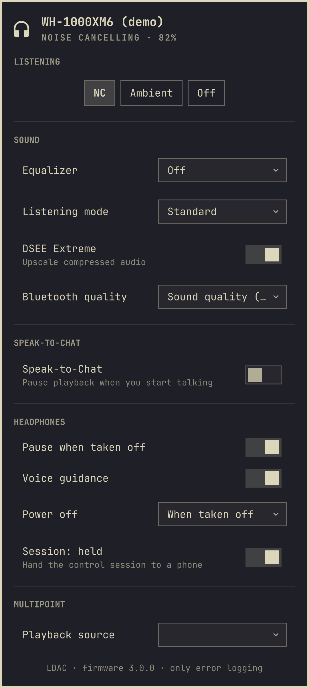

# Using the plugin

The owner's guide: install it, work it from the bar, understand every setting,
and sort out the two things that most often look like faults — a setting that
will not take, and a phone that will not share the headphones.

This page assumes you have an Omarchy desktop and a paired Sony headset. The
plugin is a bar widget that speaks Sony's own Bluetooth protocol; it needs no
phone app and no desktop GUI. A contributor's view is in
[architecture.md](architecture.md); the agent reference is
[../agents.md](../agents.md).

## What it is

Sony's headphones are controlled by the Headphones Connect phone app over a
private Bluetooth protocol, not by a standard desktop control. This plugin
speaks that protocol directly. A small helper process talks to the headphones
over RFCOMM and serves a local socket; the bar widget shows what the headphones
report and sends your changes back.

Nothing here touches the network, and the helper never changes a setting unless
you ask it to.



## Requirements

- Omarchy 4.0 or newer
- `python3` and `bluez-utils` (both already on a stock Omarchy install)
- Headphones paired and connected

## Install

```bash
omarchy plugin add https://github.com/gabamnml/omarchy-sony-headphones --enable
```

To place it somewhere specific in the bar:

```bash
omarchy bar move gabamnml.sony-headphones --section right --index 0
```

## Uninstall

```bash
omarchy plugin remove gabamnml.sony-headphones
```

That takes the widget off the bar and deletes the plugin directory. One thing
lives outside it and can go too, though nothing depends on it:

```bash
rm -rf ~/.cache/omarchy-sony-headphones     # the remembered RFCOMM channel and the log
```

The control socket and lock live in `$XDG_RUNTIME_DIR` while a daemon is
running; the socket is removed when it exits. The helper process stops with the
shell; it holds no state of its own.

## Daily use

### The bar icon

The widget sits in the bar with the battery reading beside it. The icon follows
the mode: headphones while noise cancelling, an ear in ambient sound, struck
through when the headphones are off or away.

| Gesture | What it does |
|---|---|
| Left click | Open the panel |
| Right click | Cycle noise cancelling → ambient sound → off |
| Scroll | Ambient sound level |
| Middle click | Refresh |

### The panel

Inside the panel: `j`/`k` or the arrow keys move, `h`/`l` adjust the row under
the cursor, `Enter` toggles, `Esc` closes. Shortcuts: `n` cycles the mode, `d`
toggles DSEE, `s` toggles Speak-to-Chat, `r` refreshes.

A row the headphones do not support is not drawn at all. A row that exists but
is blocked right now is drawn greyed, with the reason in a tooltip, and clicking
it does nothing.

### A keybinding

The widget exposes IPC, so noise cancelling can hang off a key. In
`~/.config/hypr/bindings.lua`:

```lua
o.bind("SUPER", "N", "Cycle noise cancelling",
  "omarchy-shell gabamnml.sony-headphones cycle")
```

Also available: `open` (alias `show`), `close` (alias `hide`), `toggle`,
`release`, `reclaim`, `mode <name>`, `ambient <0-20>`, `status`.

## Widget settings

These are configured from the shell's widget settings, or directly on the entry
in `~/.config/omarchy/shell.json`:

| Key | Default | Meaning |
|---|---|---|
| `showBattery` | `On` | Show the battery percentage next to the icon |
| `address` | — | Pin a MAC address when several Sony devices are connected |
| `logging` | `errors` | Starting log level for the helper: `errors`, `all` or `off` |
| `sessionPolicy` | `hold` | `hold` keeps the one control session; `on-demand` releases it after the idle delay so a phone can take over |
| `idleSeconds` | `30` | Quiet seconds before an `on-demand` session is released; only used by `on-demand` |

`sessionPolicy` and `idleSeconds` only make sense once you know what the
control session is; it is explained under [The control
session](#the-control-session) below.

## Headphone controls

These are the rows the panel draws, and what they change on the headphones. A
model that does not honour one does not get the row.

| Setting | Notes |
|---|---|
| Noise cancelling / Ambient sound / Wind noise reduction / Off | Wind noise reduction appears only on models that report it |
| Ambient level | 0–20, with Focus on Voice |
| Equalizer | Eight tone presets plus Off and Manual; custom bands via the CLI, which also accepts the v1-only `custom-1` and `custom-2` preset codes. A v2 device has its own table — Off, Heavy, Clear, Hard, Soft and Custom — with a ten-band custom curve via the CLI |
| DSEE Extreme | Upscaling of compressed audio |
| Connection quality | Prioritize sound quality (LDAC) or a stable connection (SBC); v2 only |
| Listening mode | Standard, Background music or Cinema — Background music also picks the room it simulates (My Room, Living Room, Cafe); v2 only |
| Multipoint | List connected devices and switch which one plays; v2 only (verified on the WH-1000XM6) |
| Speak-to-Chat | On/off, sensitivity, resume timeout, voice focus where the model offers it |
| Pause when taken off, voice guidance | Voice guidance on v1 everywhere, on v2 only the WH-1000XM5/XM6 |
| Touch controls | On models that allow it — not the WH-1000XM4 |
| Automatic power off | Never or when taken off; timers on models that honour them |
| Battery, firmware, codec | Read-only |

Background music is unavailable while a digital assistant is set: Sound Connect
greys the setting out with "check Voice control / Voice assistant", and writing
it anyway makes the WH-1000XM6 reset. The helper cannot read that setting, so it
does not grey the row yet — set Voice control to **Not set** in Sound Connect
first.

## The control session

A Sony headset holds exactly one control session at a time: while this plugin's
daemon owns it, a phone paired over multipoint cannot take it, and the reverse.
Two settings decide how the daemon behaves, and a toggle hands the session over
by hand.

`hold` (the default) keeps the session open, so the widget always has live
settings. `on-demand` releases it after a quiet spell, letting a phone take
over; the length of the spell is `idleSeconds` (default 30, whole seconds from
1 to 86400). The spell is measured from the last client command that touched
the device — a `set`, a `cycle`, a `refresh` — never from the daemon's own
periodic poll or from a subscriber reading the state, or `on-demand` would
never fire. Any command that needs the device reclaims a released session on
its own, so there is no need to reclaim before changing a setting.

The panel carries the session as its own row, drawn for every connected device:
`Session: held`, `Session: released` or `Session: connecting`. Activating it
hands the session to a phone, or takes it back. While the session is
deliberately released the panel keeps showing the last values the device
reported rather than going blank. With `on-demand`, the headset leaving
Bluetooth range releases the session automatically and its return reclaims it —
but only a release the presence signal caused; a release made by hand is never
undone by a connect event, and `hold` never releases on its own.

The same controls are on the command line and the socket. `session` with no
arguments reports the policy the running daemon uses; with arguments it changes
it at runtime:

```bash
bin/sony-headphones release             # hand the session to a phone
bin/sony-headphones reclaim             # take it back and refresh
bin/sony-headphones session                              # Session: held (hold, idle 30s)
bin/sony-headphones session on-demand --idle 60          # release after a minute quiet
bin/sony-headphones session hold                         # keep it, as always
```

Over the control socket these are `{"cmd": "release"}`, `{"cmd": "reclaim"}` and
`{"cmd": "session", "value": "on-demand", "idle": 60}`; either field may be
omitted on a `session` request. A release is a deliberate hand-off, not an
error: it sets no error, keeps the last known values, and keeps the cached
RFCOMM channel, so reclaiming skips discovery.

## The command line

The helper works on its own, with or without the widget. `--address` pins a
device when several Sony ones are connected, and `--json` prints the state as
JSON instead of a table:

```bash
bin/sony-headphones status              # everything the headphones report
bin/sony-headphones --json status       # the same state as JSON
bin/sony-headphones --address AA:BB:CC:DD:EE:FF status   # pick a device
bin/sony-headphones probe               # diagnose the connection
bin/sony-headphones cycle               # noise cancelling → ambient → off
bin/sony-headphones power-off           # turn the headphones off (v1 only)
bin/sony-headphones set nc ambient-sound
bin/sony-headphones set ambient-level 12
bin/sony-headphones set eq bass-boost             # v1 only; v2 has its own table
bin/sony-headphones set eq custom-1               # v1 only: the headphone's own custom slots
bin/sony-headphones set eq-bands "2,0,1,0,-1,3"   # v1: clear bass + 5 bands, -10..10
bin/sony-headphones set eq-bands "0,1,2,3,4,5,6,-1,-2,-3"  # v2: 10 bands, -6..6
bin/sony-headphones set dsee toggle
bin/sony-headphones set connection-quality sound-quality
bin/sony-headphones set connection-quality stable
bin/sony-headphones set listening-mode cinema
bin/sony-headphones set listening-mode background-music
bin/sony-headphones set bgm-room-size cafe
bin/sony-headphones set playback-source AA:BB:CC:DD:EE:FF   # the multipoint peer to make active
bin/sony-headphones set speak-to-chat on
bin/sony-headphones release              # hand the one control session to a phone
bin/sony-headphones reclaim              # take it back and refresh
bin/sony-headphones session                              # show the session policy
bin/sony-headphones session on-demand --idle 60          # release after a minute quiet
bin/sony-headphones session hold                         # keep the session, as always
bin/sony-headphones logging             # show the running daemon's log level
bin/sony-headphones logging off|errors|all
bin/sony-headphones watch               # stream state changes as JSON lines
```

## How a change is confirmed

A setting is only believed once the device reads it back. The state carries two
fields for that: `pending` lists the settings written but not yet confirmed —
the helper waits roughly two seconds for the device's own read-back — and
`refused` maps a setting to the reason its write did not move anything (`the
headphones did not change <key>`). In the panel a row being confirmed carries
an ellipsis after its label, a refused row is drawn in the urgent colour, and
every refusal is repeated in one quiet summary line. The acknowledgement is
never the proof: some writes are answered and then discarded, so only a
read-back that moved settles a key.

With `--json` a refused command's reason rides in the state's `error` field; the
human-readable `status` table does not show refusal reasons.

## Troubleshooting

### A setting will not take

- If the row is greyed, hover it: the tooltip names what is blocking it.
- If the row shows a refusal, the message says the headphones did not change
  the value. A refusal is cleared by writing the same setting again.
- Some models answer a write and then discard it, or honour only a subset. The
  per-model detail is in [../agents.md](../agents.md#settings-by-model), with
  the cited research in
  [../agents.md](../agents.md#capability-and-exclusion-matrix).
- Background music is refused while a digital assistant is set: set Voice
  control to **Not set** in Sound Connect.

### Nothing is updating

Try the panel's refresh (`r`, or middle-click the bar icon), then
`bin/sony-headphones probe` for a connection diagnosis. The headphones drop the
control session on their own after a while and announce nothing, so a command
that arrives on a dead link reconnects and runs rather than failing in your
hands.

### A phone and the widget fight over the headphones

This is the one-session rule. Under `hold` the widget keeps the session, so
the phone app may not be able to connect; use the panel's session row or
`bin/sony-headphones release` to hand it over. Under `on-demand` the widget
releases automatically after the idle delay, so the phone can take over on its
own. The panel always shows which state the session is in. The full behaviour
is in [architecture.md](architecture.md#the-session-lifecycle-and-the-presence-signal)
and [../adr/0008-session-policy-and-manual-release.md](../adr/0008-session-policy-and-manual-release.md).

### Logs

The panel has a logging link at its bottom; clicking it cycles the running
daemon through `errors` → `all` → `off`. The same is available from the command
line:

```bash
bin/sony-headphones logging          # show the current level
bin/sony-headphones logging all      # keep full detail
bin/sony-headphones logging errors   # back to failures only
bin/sony-headphones logging off      # write nothing
```

The log file is `$XDG_CACHE_HOME/omarchy-sony-headphones/sony-headphones.log`
(usually `~/.cache/omarchy-sony-headphones/sony-headphones.log`), mode 0600,
rotated at 256 KiB with two backups. Bluetooth addresses are redacted. It is
human-readable; it is not a byte-level frame dump. Nothing is written to
stdout or stderr.

When you need to see the bytes themselves, `SONY_HEADPHONES_TRACE` writes every
frame the helper sends and receives. Stop the widget's helper first — it owns
the Bluetooth link, and two helpers cannot hold the same control channel:

```bash
SONY_HEADPHONES_TRACE=/tmp/sony.trace bin/sony-headphones probe
SONY_HEADPHONES_TRACE=/tmp/sony.trace bin/sony-headphones set nc ambient-sound
```

A value of `1` writes the trace to stderr, which is fine for a one-off command
but not for the daemon the widget runs.

### Removing the leftovers

Uninstalling the plugin leaves the cache directory and log behind by design.
They can be removed with `rm -rf ~/.cache/omarchy-sony-headphones` (see
[Uninstall](#uninstall)).

## Where to read more

- [index.md](index.md) — the wiki home and who each page is for.
- [architecture.md](architecture.md) — how the plugin is built.
- [../adr/](../adr/) — the architecture decision records.
- [../agents.md](../agents.md) — the agent reference: wire protocol, symbol
  map, per-model settings.
